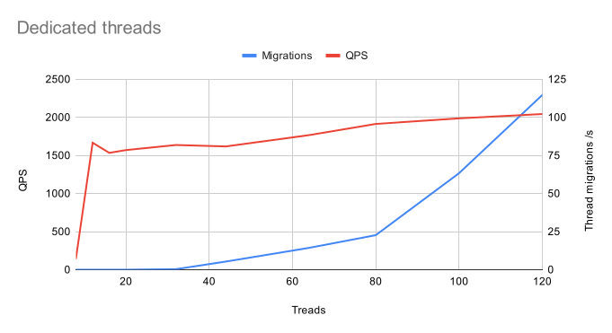

# Benchmarks for the thread model when blocking and non-blocking calls are dispatched into separate thread pools

Benchmark the improvements in reducing thread relocation overhead when rescheduling the blocking calls into dedicated thread pool.

* [Demo video](https://youtu.be/OXmj_9TGbpk)

The workload unit is both CPU and memory intensive, with some additional lock contention.
The various thread workload runners are mixing this workload with blocked sleep to emulate blocking I/O.
In all benchmarks below the combined unit of work is 20% computational work and 80% sleep, which
is representative to a typical large server workload. 

The baseline for benchmarks is the simple case when all workloads loop in dedicated threads.
This emulates a server that has a thread per connection and receives continuous requests on each.

All benchmarks are run on 16 core Intel Xeon Platinum 8275CL 3.00GHz.

> 1. Maximum QPS was achieved above 100 threads
> 2. The scalability was linear only up to 8 threads
> 3. Thread migrations started increasing fast after 80 threads

This model is problematic because:

1. It requires capping the client connections
2. The maximum safe connection count is unknown and depends on workload
3. Too many threads do not scale well
4. Kernel load balancer has to migrate threads to other cores, which is expensive

